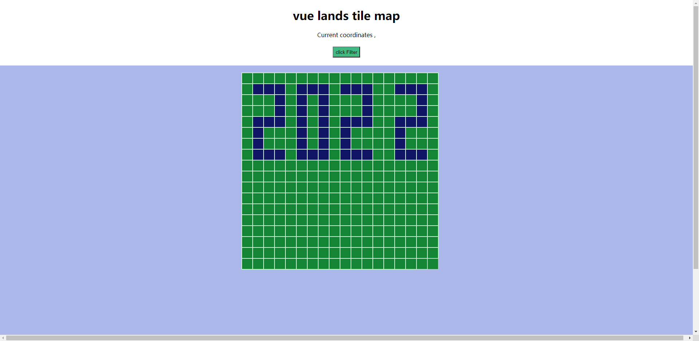

<h1 align="center">
   VUE Lands Tile Map Component
</h1>

[![npm][npm]][npm-url]
[![node][node]][node-url]


### NFT Metaverse Lands Vue Tile Map Component

## demo
https://daudxu.github.io/vue-lands-tile-map/

## Preview



## Installation

```
npm install vue-lands-tile-map
```
## Usage

### Import

```

import VueLandsTileMap from 'vue-lands-tile-map'

Vue.use(VueLandsTileMap);


```

### demo

```
<template>
  <div class="hello">
    <h1>{{ msg }}</h1>
    <p>
      <span> Current coordinates {{x}},{{y}}</span>
    </p>
    <h5> <span> <button @click="handleClickFilter"> click Filter</button></span> </h5>

    <div style="display: flex;justify-content: center; margin-top: 20px;">

      <vue-lands-tile-map ref="landsTileMapRef"
                          :tileMapMapmatrix="tileMapMapmatrix"
                          :tiledDigitalColormap="tiledDigitalColormap"
                          :tileSize="tileSize"
                          :startPaintingX="startPaintingX"
                          :startPaintingY="startPaintingY"
                          @handleClickTile="handleClickTile"
                          @test="ceshi">
      </vue-lands-tile-map>
    </div>

  </div>
</template> 

<script>

export default {
  name: 'HelloWorld',
  props: {
    msg: String
  },
  data () {
    return {
      tileMapMapmatrix: [
        [0, 0, 0, 0, 0, 0, 0, 0, 0, 0, 0, 0, 0, 0, 0, 0, 0, 0],
        [0, 1, 1, 1, 0, 1, 1, 1, 0, 1, 1, 1, 0, 0, 1, 1, 1, 0],
        [0, 0, 0, 1, 0, 1, 0, 1, 0, 0, 0, 1, 0, 0, 0, 0, 1, 0],
        [0, 0, 0, 1, 0, 1, 0, 1, 0, 0, 0, 1, 0, 0, 0, 0, 1, 0],
        [0, 1, 1, 1, 0, 1, 0, 1, 0, 1, 1, 1, 0, 0, 1, 1, 1, 0],
        [0, 1, 0, 0, 0, 1, 0, 1, 0, 1, 0, 0, 0, 0, 1, 0, 0, 0],
        [0, 1, 0, 0, 0, 1, 0, 1, 0, 1, 0, 0, 0, 0, 1, 0, 0, 0],
        [0, 1, 1, 1, 0, 1, 1, 1, 0, 1, 1, 1, 0, 0, 1, 1, 1, 0],
        [0, 0, 0, 0, 0, 0, 0, 0, 0, 0, 0, 0, 0, 0, 0, 0, 0, 0],
        [0, 0, 0, 0, 0, 0, 0, 0, 0, 0, 0, 0, 0, 0, 0, 0, 0, 0],
        [0, 0, 0, 0, 0, 0, 0, 0, 0, 0, 0, 0, 0, 0, 0, 0, 0, 0],
        [0, 0, 0, 0, 0, 0, 0, 0, 0, 0, 0, 0, 0, 0, 0, 0, 0, 0],
        [0, 0, 0, 0, 0, 0, 0, 0, 0, 0, 0, 0, 0, 0, 0, 0, 0, 0],
        [0, 0, 0, 0, 0, 0, 0, 0, 0, 0, 0, 0, 0, 0, 0, 0, 0, 0],
        [0, 0, 0, 0, 0, 0, 0, 0, 0, 0, 0, 0, 0, 0, 0, 0, 0, 0],
        [0, 0, 0, 0, 0, 0, 0, 0, 0, 0, 0, 0, 0, 0, 0, 0, 0, 0],
        [0, 0, 0, 0, 0, 0, 0, 0, 0, 0, 0, 0, 0, 0, 0, 0, 0, 0],
        [0, 0, 0, 0, 0, 0, 0, 0, 0, 0, 0, 0, 0, 0, 0, 0, 0, 0]
      ],
      tileMapMapmatrixToc: [
        [0, 0, 0, 0, 0, 0, 0, 0, 0, 0, 0, 0, 0, 0, 0, 0, 0, 0],
        [0, 0, 0, 0, 0, 0, 0, 0, 0, 0, 0, 0, 0, 0, 0, 0, 0, 0],
        [0, 0, 0, 0, 0, 0, 0, 0, 0, 0, 0, 0, 0, 0, 0, 0, 0, 0],
        [0, 0, 0, 0, 0, 0, 0, 0, 0, 0, 0, 0, 0, 0, 0, 0, 0, 0],
        [0, 0, 0, 0, 0, 0, 0, 0, 0, 0, 0, 0, 0, 0, 0, 0, 0, 0],
        [0, 0, 0, 0, 0, 0, 0, 0, 0, 0, 0, 0, 0, 0, 0, 0, 0, 0],
        [0, 0, 0, 0, 0, 0, 0, 0, 0, 0, 0, 0, 0, 0, 0, 0, 0, 0],
        [0, 0, 0, 0, 0, 0, 0, 0, 0, 0, 0, 0, 0, 0, 0, 0, 0, 0],
        [0, 0, 0, 0, 0, 0, 0, 0, 0, 0, 0, 0, 0, 0, 0, 0, 0, 0],
        [0, 0, 1, 1, 1, 0, 0, 0, 1, 0, 1, 1, 1, 0, 0, 0, 0, 0],
        [0, 0, 0, 0, 1, 0, 0, 0, 1, 0, 1, 0, 1, 0, 0, 0, 0, 0],
        [0, 0, 0, 0, 1, 0, 0, 0, 1, 0, 1, 0, 1, 0, 0, 0, 0, 0],
        [0, 0, 1, 1, 1, 0, 0, 0, 1, 0, 1, 1, 1, 0, 0, 0, 0, 0],
        [0, 0, 1, 0, 0, 0, 0, 0, 1, 0, 1, 0, 1, 0, 0, 0, 0, 0],
        [0, 0, 1, 0, 0, 0, 0, 0, 1, 0, 1, 0, 1, 0, 0, 0, 0, 0],
        [0, 0, 1, 1, 1, 0, 1, 0, 1, 0, 1, 1, 1, 0, 0, 0, 0, 0],
        [0, 0, 0, 0, 0, 0, 0, 0, 0, 0, 0, 0, 0, 0, 0, 0, 0, 0],
        [0, 0, 0, 0, 0, 0, 0, 0, 0, 0, 0, 0, 0, 0, 0, 0, 0, 0]
      ],
      tiledDigitalColormap: [
        { 0: '#138535' },
        { 1: '#101566' },
        { 2: '#0070c0' }
      ],
      tileSize: 30,
      x: 0,
      y: 0,
      flag: true,
      startPaintingX: (window.innerWidth / 2) - 288,
      startPaintingY: 20
    }
  },
  methods: {
    ceshi () {
      console.log('ceshi');
    },
    handleClickTile (e) {
      if (typeof (this.tileMapMapmatrix[e.clickY][e.clickX]) !== 'undefined') {
        this.x = e.x;
        this.y = e.y;
      } else {
        this.x = '';
        this.y = '';
      }
    },
    handleClickFilter () {
      var tileMap = this.tileMapMapmatrix;
      var flag = this.flag;
      if (flag) {
        tileMap = this.$refs.landsTileMapRef.blockCoverage(tileMap, this.tileMapMapmatrixToc);
        flag = false;
      } else {
        flag = true;
      }
      this.flag = flag;
      this.$refs.landsTileMapRef.handleClickAssignRender(tileMap);
    }
  }
}
</script>

<style scoped>
.hello {
  text-align: center;
}
button {
  height: 30px;
  background: #42b983;
  cursor: pointer;
}
h3 {
  margin: 40px 0 0;
}
ul {
  list-style-type: none;
  padding: 0;
}
li {
  display: inline-block;
  margin: 0 10px;
}
a {
  color: #42b983;
}
</style>

```

具体使用可参考[该文件](../../examples/landsTileMap.vue)。

## Options

| 配置项                  | 值类型   | 描述                                                                          |
| ----------------------- | -------- | ----------------------------------------------------------------------------- |
| tileMapMapmatrix        | Array    | lands tile Map Mapmatrix                                                      |
| tiledDigitalColormap    | Array    | Colors corresponding to digital tile maps                                     |
| canvasWidth             | Number   | canvas width，default `window.innerWidth`                                     |
| canvasHeight            | Number   | canvas height，default `window.innerHeight`                                   |
| tileSize                | Number   | tile map Size，default 32                                                     |
| tileScale               | Number   | tile map Scale，default 1                                                     |
| startPaintingX          | Number   | The horizontal coordinate of the starting point of the drawing，default 0     |
| startPaintingY          | Number   | The ordinate of the starting point of the drawing，default 0                  |
| gridLineColor           | String   | grid Line Color，default '#c8efd4'                                            |
| gridDefaultTileColor    | String   | grid Default Tile Color，default '#ffffff'                                    |
| handleClickTile         | function | Click to return to coordinates Returns the coordinates and click event object |
| handleClickAssignRender | function | render canvas view                                                            |
| blockCoverage           | function | Merge large block matrices                                                    |

## Features

  - [X] Built for Ethereum using [Web3](https://github.com/ethereum/web3.js/).
  - [X] Implements [Graph Protocol](https://github.com/graphprotocol) to read blockchain.
## Changelog

### 2022.02.17

> v0.0.1 \* Matrix, color block, drag

[npm]: https://img.shields.io/npm/v/postcss-load-config.svg
[npm-url]: https://npmjs.com/package/postcss-load-config
[node]: https://img.shields.io/node/v/postcss-load-plugins.svg
[node-url]: https://nodejs.org/
